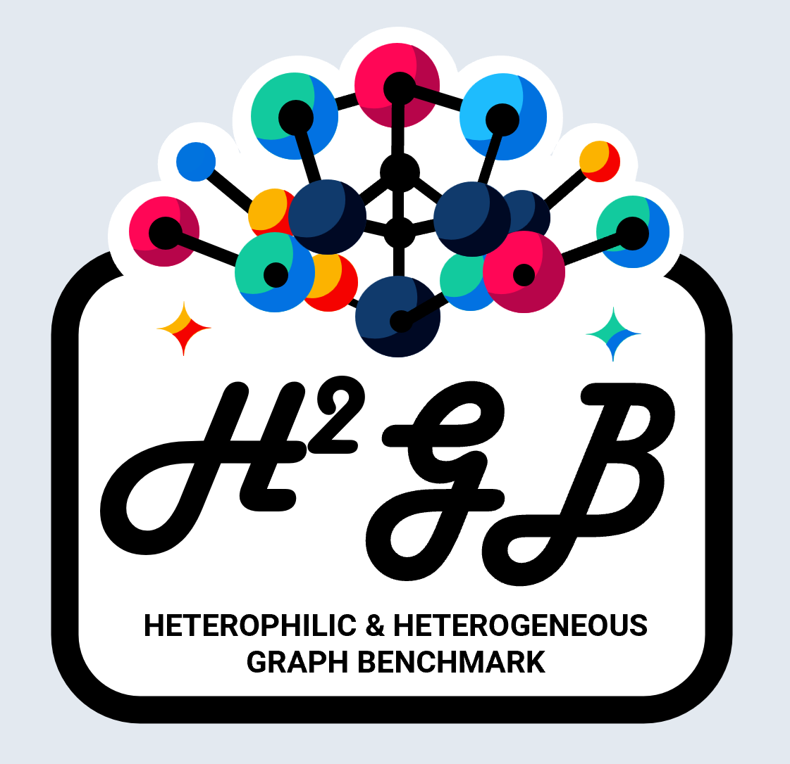

<p align="center">
  
</p>

<p align="center">
	<a href=""></a>
	<a href="https://pypi.org/project/py-tgb/"></a>
	<a href="https://github.com/junhongmit/H2GB/blob/main/LICENSE"></a>
	<a href="https://junhongmit.github.io/H2GB/"></a>
</p>

--------------------------------------------------------------------------------

## Overview
The Heterophilic and Heterogeneous Graph Benchmark (H²GB) is a collection of graph benchmark datasets, data loaders, modular graph transformer framework (UnifiedGT) and evaluators for graph learning.
The H²GB encompasses 9 diverse real-world datasets across 5 domains. Its data loaders are fully compatible with popular graph deep learning framework [PyTorch Geometric](https://pytorch-geometric.readthedocs.io/en/latest/). They provide automatic dataset downloading, standardized dataset splits, and unified performance evaluation.

<p align='center'>
  
</p>

## Environment Setup
You can create a conda environment to easily run the code. For example, we can create a virtual environment named `H2GB`:
```
conda create -n H2GB python=3.9 -y
conda activate H2GB
```
Install the required packages using the following commands:
```
conda install pytorch torchvision torchaudio pytorch-cuda=11.8 -c pytorch -c nvidia
conda install pyg -c pyg
pip install -r requirements.txt
```

## Run the Code
You will need to firstly specify the dataset and log location by editing the config file provided under `./configs/{dataset_name}/`. An example configuration is
```
......
out_dir: ./results
dataset:
  dir: ./data
......
```
Dataset download will be automatically initiated if dataset is not found under the specified location.

For convenience, a script file is created to run the experiment with specified configuration. For instance, you can edit and run the `interactive_run.sh` to start the experiment.
```
cd H2GB
chmox +x ./run/interactive_run.sh
./run/interactive_run.sh
```

## Components
### Encoders
The Hetero_Raw encoder are supposed to be used for heterogeneous GNN or graph dataset that has  different node encoding dimensions for different node type. Therefore, each node type can be transformed separately. To reproduce results of homogeneous GNN, consider using the Raw encoder, which apply the same transformation for each node type. Otherwise, using Hetero_Raw for homogeneous GNN will misleadingly increase the task performance.
