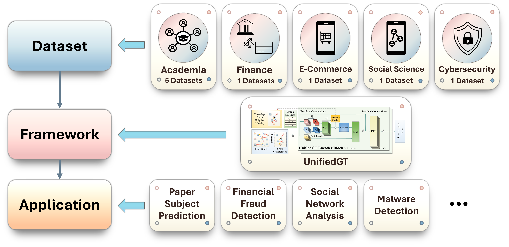

:github_url: https://github.com/junhongmit/H2GB

H²GB Documentation
==================

:h2gb:`null` **H²GB** *(Heterophilic and Heterogeneous Graph Benchmark)* is a library built 
upon :pytorch:`null` `PyTorch <https://pytorch.org>`_, :pyg:`null` `PyTorch Geometric <https://www.pyg.org/>`_ and 
:graphgym:`null` `GraphGym <https://github.com/snap-stanford/GraphGym>`_.
It is a collection of graph benchmark datasets, data loaders, modular graph transformer framework
(UnifiedGT) and evaluators for graph learning. The H²GB encompasses 9 diverse real-world datasets
across 5 domains. Its data loaders are fully compatible with popular graph deep learning framework
:pyg:`null` PyTorch Geometric. They provide automatic dataset downloading, standardized dataset splits,
and unified performance evaluation.

|

.. toctree::
   :maxdepth: 1
   :caption: Install H²GB

   install/installation

.. toctree::
   :maxdepth: 1
   :caption: Get Started

   get_started/introduction

.. toctree::
   :maxdepth: 1
   :caption: Tutorials

   .. tutorial/gnn_design
   .. tutorial/dataset
   .. tutorial/application
   .. tutorial/distributed

.. toctree::
   :maxdepth: 1
   :caption: Package Reference

   modules/datasets
   .. modules/sampler
   .. modules/encoder
   .. modules/network
   .. modules/head
   

   .. modules/data
   .. modules/loader
   .. modules/transforms
   .. modules/utils
   .. modules/explain
   .. modules/metrics
   .. modules/distributed
   .. modules/contrib
   .. modules/graphgym
   .. modules/profile

Indices and tables
==================

* :ref:`genindex`
* :ref:`modindex`
* :ref:`search`
