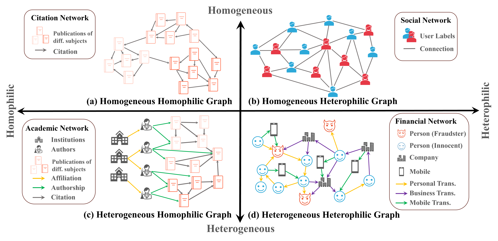

Introduction by Example
=======================

We shortly introduce the datasets provided by :h2gb:`ℋ²GB` and the versatile :unifiedgt:`UnifiedGT` framework through self-contained examples.

For an introduction to Graph Machine Learning, we refer the interested reader to the :stanford:`null` `Stanford CS224W: Machine Learning with Graphs <https://www.youtube.com/watch?v=JAB_plj2rbA>`__ lectures.

At its core, :h2gb:`ℋ²GB` provides the following main features:

.. contents::
    :local:

Heterophilic and Heterogeneous Graph Datasets
---------------------------------------------

Many real-world graphs, such as academic networks, social networks and financial networks, frequently present challenges for graph learning due to *heterophily*, where connected nodes may have dissimilar labels and attributes, and *heterogeneity*, where multiple types of entities and relations among the graphs are embodied by various types of nodes and edges. Each of these two properties can significantly impede the performance of graph learning models.
While there have been advancements in handling graph with heterophily and heterogeneity seperately, there is a lack of research on learning on graphs with both of these two properties, which many real-world graphs have. For example, financial networks (subfigure (d)) are both heterophilic and heterogeneous. Different node types (person, business, etc.) and edge types (wire transfer, credit card transaction, etc.) exist, making the graph heterogeneous.
The class labels of fraudsters differ from those of their innocent neighbors, making the graph heterophilic. There are also many graphs from other domains that are both heterophilic and heterogeneous, such as networks from e-commerce, academia, and cybersecurity.

|

In :h2gb:`ℋ²GB`, we provide 9 diverse real-world datasets across 5 domains -- academia, finance, e-commerce, social science, and cybersecurity.

|pic1| |pic2| |pic3| |pic4| |pic5|

.. |pic1| image:: ../_static/domain_academia.png
   :width: 19%
   :target: ../modules/datasets.html#academia

.. |pic2| image:: ../_static/domain_finace.png
   :width: 19%
   :target: ../modules/datasets.html#finace

.. |pic5| image:: ../_static/domain_cybersecurity.png
   :width: 19%
   :target: ../modules/datasets.html#cybersecurity

Access Datasets
---------------

Datasets can be easily loaded through the :obj:`create_dataset()` method. :h2gb:`ℋ²GB` is gloablly configured by an internal
config tree. In the following example, we demonstrate that by loading an external :obj:`mag-year-MLP` configuration file, you
are able to access the :obj:`mag-year` dataset. 

.. Note::
    It's also possible to directly modify the attributes inside the :obj:`cfg` variable,
    without the need to load an external configuration file.

.. code-block:: python

    import argparse
    import H2GB
    from H2GB.graphgym.config import cfg, set_cfg, load_cfg
    from H2GB.graphgym.loader import create_dataset

    # Load cmd line args
    parser = argparse.ArgumentParser(description='H2GB')
    parser.add_argument('--cfg', dest='cfg_file', type=str, required=True,
                        help='The configuration file path.')
    parser.add_argument('opts', default=None, nargs=argparse.REMAINDER,
                        help='See graphgym/config.py for remaining options.')

    args = parser.parse_args(["--cfg", "configs/mag-year/mag-year-MLP.yaml"])
    # Load config file
    set_cfg(cfg)
    load_cfg(cfg, args)

    dataset = create_dataset()
    data = dataset[0]
    print(dataset)
    print(data)

Running Experiments
-------------------

Experiments are configued by configuration files available in :obj:`./configs` and are easy to reproduce.
Before reproducing experiments, you will need to firstly specify the dataset and log locations by editing the config file provided under :obj:`./configs/{dataset_name}/`. An example configuration is

.. code-block:: none

    ......
    out_dir: ./results/{Model Name} # Put your log output path here
    dataset:
    dir: ./data # Put your input data path here
    ......

Create empty folders for storing the dataset and results. Dataset download will be automatically initiated if dataset is not found under the specified location.

For convenience, a script file is created to run the experiment with specified configuration. For instance, you can edit and run the :obj:`interactive_run.sh` to start the experiment.

.. code-block:: bash

    # Assuming you are located in the H2GB repo
    chmox +x ./run/interactive_run.sh
    ./run/interactive_run.sh

You can also directly enter this command into your terminal:

.. code-block:: bash

    python -m H2GB.main --cfg {Path to Your Configs} name_tag {Custom Name Tag}

For example, the following command is to run :obj:`MLP` model experiment for :obj:`oag-cs` dataset.

.. code-block:: bash

    python -m H2GB.main --cfg configs/oag-cs/oag-cs-MLP.yaml name_tag MLP

.. Note::
    :h2gb:`ℋ²GB` currently only supports CPU or single-GPU training. You can specify the :obj:`device` entry in the configuration files as follow. The default
    value of :obj:`device` is :obj:`auto`, which will automatically detect GPU device and select the GPU with the least memory usage.

    .. code-block:: none

        ......
        device: cpu/cuda/cuda:0/auto
        ......

Make Use of Modular Ingredients
-------------------------------

In the following, we list out the available modular ingredients provided in :unifiedgt:`UnifiedGT` framework.

.. list-table::
   :widths: 20 20 20 20 20
   :header-rows: 1
   :class: centered-table

   * - Graph Sampling
     - Graph Encoding
     - Graph Attention
     - Attention Masking
     - Feedforward Networks (FFNs)
   * - `Neighbor Sampling <../generated/H2GB.sampler.get_NeighborLoader.html>`__
     - `Node2Vec Embedding <../generated/H2GB.encoder.Node2VecNodeEncoder.html>`__
     - Plain Attention
     - None
     - Single
   * - `GraphSAINT Sampling <../generated/H2GB.sampler.get_GrashSAINTRandomWalkLoader.html>`__
     - `Metapath2Vec Embedding <../generated/H2GB.encoder.MetapathNodeEncoder.html>`__
     - Cross-type Heterogeneous Attention
     - Direct Neighbor Mask
     - Type-specific
   * - `HGSampling <../generated/H2GB.sampler.get_HGTloader.html>`__
     - `Knowledge Graph Embedding <../generated/H2GB.encoder.TransENodeEncoder.html>`__
     - 
     - 
     - 
   * - 
     - `Masked Label Embedding <>`__
     -
     -
     -

You can make use of each component by specifying the configuration files. We list a few examples in the following subsections.

Graph Sampling
^^^^^^^^^^^^^^

For example, to select different graph sampler, you only need to modify the :obj:`train.sampler`, :obj:`train.neighbor_sizes` and :obj:`val.sampler`.
To use a `neighbor sampler <../generated/H2GB.sampler.get_NeighborLoader.html>`__, set as the following

.. code-block:: none

        ......
        train:
            sampler: hetero_neighbor
            neighbor_sizes: [20, 15, 10]
        ......
        val:
            sampler: hetero_neighbor
        ......

Graph Encoding
^^^^^^^^^^^^^^

To select different graph encoding method, you only need to modify the :obj:`dataset.node_encoder_name`.
To use a `Node2Vec embedding <../generated/H2GB.encoder.Node2VecNodeEncoder.html>`__, set as the following

.. code-block:: none

        ......
        dataset:
            node_encoder_name: Raw+Hetero_Node2Vec
        ......

You can even combine multiple graph encoding together, for example, combining masked label embedding and `Metapath2Vec <../generated/H2GB.encoder.MetapathNodeEncoder.html>`__ together

.. code-block:: none

        ......
        dataset:
            node_encoder_name: Raw+Hetero_Label+Hetero_Metapath
        ......

Graph Attention
^^^^^^^^^^^^^^^

To select different graph encoding method, you can modify the :obj:`gt.layer_type`. We have several graph transformer examples that made
use of different graph attention, such as in :obj:`GraphTrans` and :obj:`Gophormer`:

.. code-block:: none

        ......
        gt:
            layer_type: TorchTransformer/SparseNodeTransformer
        ......

Attention Masking
^^^^^^^^^^^^^^^^^

You can apply different attention masking method by changing the :obj:`gt.attn_mask`.

.. code-block:: none

        ......
        gt:
            attn_mask: none/Edge/kHop
        ......

Feedforward Networks (FFNs)
^^^^^^^^^^^^^^^^^^^^^^^^^^^

We provide two choices in the :obj:`gt.ffn`, corresponding to single FFN and type-specific FFN.

.. code-block:: none

        ......
        gt:
            ffn: Single/Type
        ......

Metric Selection
----------------

As our :unifiedgt:`UnifiedGT` framework provides a unified evaluator, you can conveniently select different evaluation metric depends on the demand of your custom dataset.
You just need to specify :obj:`metric_best` in your configuration file. For example :obj:`metric_best: accuracy`.
We have provided many choices of evaluation metrics, which is defined in :obj:`./H2GB/logger.py`. We defined 3 scenarios of downstream tasks, which are binary classification,
multi-class classification and multi-label classification. We details the definition of these three scenarios and their correpsonding supported metrics in the following subsections.

Binary Classification
^^^^^^^^^^^^^^^^^^^^^

The goal of binary classification is to categorize data into one of two classes or categories. The true label is an integer containing only :math:`0`` and :math:`1`. The prediction from the model is usually
a real number which would pass through a sigmoid function to convert to a probability that it belongs to the positive class.

We support :obj:`accuracy`, :obj:`precision`, :obj:`recall`, :obj:`f1`, :obj:`macro-f1`, :obj:`micro-f1`, and :obj:`auc` for this scenario.

Multi-class Classification
^^^^^^^^^^^^^^^^^^^^^^^^^^

The goal of multi-class classification is to categorize data into more than two classes. The true label is an integer between :math:`0` and :math:`C-1`. The prediction from the model is usually
a vector of :math:`C` real number which would pass through a softmax function to convert to a probability that it belongs to a certain class.

We support :obj:`accuracy`, :obj:`f1`, and :obj:`micro-f1` for this scenario.

Multi-label Classification
^^^^^^^^^^^^^^^^^^^^^^^^^^

Multi-label classification assigns multiple labels to an instance, allowing it to belong to more than one category simultaneously. The true label is an a vector of :math:`C` binary number representing what label it has. The prediction from the model is usually
:math:`C` real number which would pass through a sigmoid function respectively to convert to a probability that it contains a certain label.

We support :obj:`accuracy`, :obj:`f1`, :obj:`auc`, and :obj:`ap` for this scenario.
