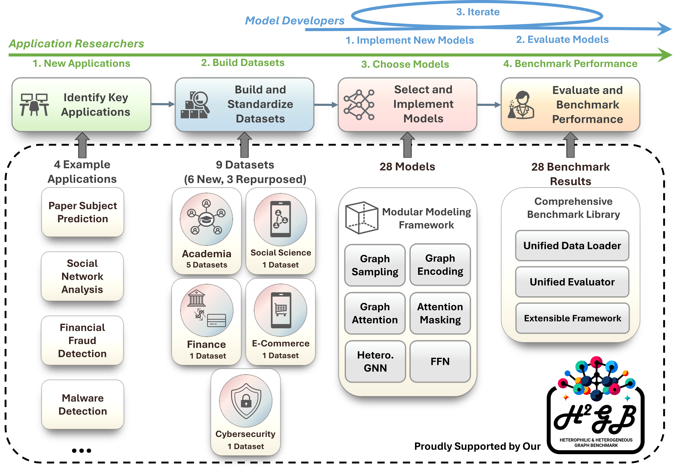

:github_url: https://github.com/junhongmit/H2GB

ℋ²GB Documentation
==================

:h2gb:`null` **ℋ²GB** *(Heterophilic and Heterogeneous Graph Benchmark)* is a library built 
upon :pytorch:`null` `PyTorch <https://pytorch.org>`_, :pyg:`null` `PyTorch Geometric <https://www.pyg.org/>`_ and 
:graphgym:`null` `GraphGym <https://github.com/snap-stanford/GraphGym>`_.
It is a collection of graph benchmark datasets, data loaders, modular graph transformer framework
(:unifiedgt:`UnifiedGT`) and evaluators designed to systematically evaluate graph learning methods in both heterophilic
and heterogeneous settings. As shown in the figure, :h2gb:`null` ℋ²GB encompasses 9 diverse real-world datasets
across 5 domains. 

We developed :unifiedgt:`UnifiedGT`, a modular graph transformer (GT) framework to summarize and systematically compare the performance of existing graph neural networks (GNNs) on this new
benchmark. :unifiedgt:`UnifiedGT` is implemented as a Python library and is user-friendly. It includes a unified data loader and evaluator,
making it easy to access datasets, evaluate methods, and compare performance. Its data loaders are fully compatible with popular graph deep learning framework
:pyg:`null` PyTorch Geometric. They provide automatic dataset downloading, standardized dataset splits,
and unified performance evaluation.

We established a standard workflow supporting both model selection and development. The green and blue arrows on top highlight two workflows how users can interact with :h2gb:`null` ℋ²GB.

:h2gb:`null` ℋ²GB includes heterophilic and heterogeneous graph datasets from 5 domains. You can find datasets categorized by domains through the following image link:

|pic1| |pic2| |pic3| |pic4| |pic5|

.. |pic1| image:: ./_static/domain_academia.png
   :width: 19%
   :target: modules/datasets.html#academia

.. |pic2| image:: ./_static/domain_finace.png
   :width: 19%
   :target: modules/datasets.html#finace

.. |pic3| image:: ./_static/domain_ecommerce.png
   :width: 19%
   :target: modules/datasets.html#ecommerce

.. |pic4| image:: ./_static/domain_social.png
   :width: 19%
   :target: modules/datasets.html#social

.. |pic5| image:: ./_static/domain_cybersecurity.png
   :width: 19%
   :target: modules/datasets.html#cybersecurity
  
.. toctree::
   :maxdepth: 1
   :caption: Install ℋ²GB

   install/installation

.. toctree::
   :maxdepth: 1
   :caption: Get Started

   get_started/introduction

.. .. toctree::
..    :maxdepth: 1
..    :caption: Tutorials

..    tutorial/gnn_design
..    tutorial/dataset
..    tutorial/application
..    tutorial/distributed

.. toctree::
   :maxdepth: 1
   :caption: Package Reference

   modules/datasets
   modules/sampler
   modules/encoder
   modules/layer
   
